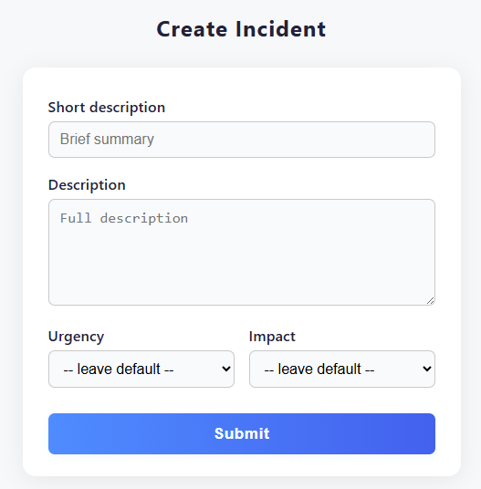

# ServiceNow Incident Form

A modern, responsive web form for creating ServiceNow incidents.  
This project provides a simple HTML/CSS/JS interface for submitting incident details, designed for easy integration with ServiceNow or as a static demo.



---

## Features

- **Modern UI:** Clean, user-friendly, and responsive design.
- **Form Fields:** Short Description, Description, Urgency, and Impact.
- **Validation:** Required fields and input validation.
- **API Ready:** Designed to POST data to a backend endpoint (`/api/incidents`).
- **Easy Deployment:** Works as a static site (for GitHub Pages) or with a backend.

---

## Usage

### 1. Static Demo (GitHub Pages)

You can deploy this as a static site (no backend functionality):

- The main HTML file is at [`docs/index.html`](docs/index.html).
- To deploy on GitHub Pages:
  1. Push your repository to GitHub.
  2. Go to **Settings > Pages**.
  3. Set the source to `main` branch and `/docs` folder.
  4. Your site will be available at `https://<your-username>.github.io/<repo-name>/`.

### 2. With Backend

To enable real incident creation, you need a backend API at `/api/incidents` that accepts POST requests with the following JSON payload:

```json
{
  "short_description": "string",
  "description": "string",
  "urgency": "1|2|3",
  "impact": "1|2|3"
}
```

---

## Screenshot

> **Note:**  
> Replace `UI.png` with your own screenshot if you customize the UI.


---

## Folder Structure

```
ServiceNow-Incident-Form/
├── docs/
│   └── index.html         # Main HTML form (for GitHub Pages)
├── public/
│   └── index.html         # (Optional) For local/static hosting
├── .env                   # (Backend credentials, not used in static site)
├── .gitignore
├── Readme.md
└── UI.png                 # Screenshot image for README
```


## Contributing

Pull requests are welcome! For major changes, please open an issue first to discuss what you would like to change.

---